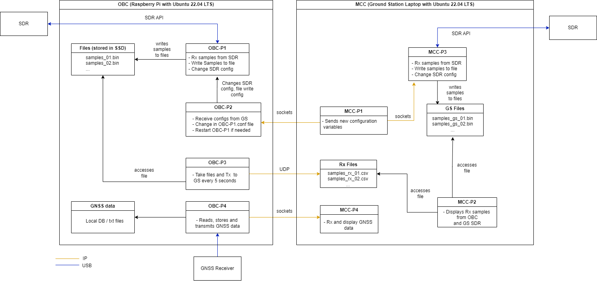

# SMART Experiment Software Architecture

#### OBC - On-Board Computer

- Raspberry Pi 4
- Running Ubuntu 22.04 LTS

OS config:
- [ ] Read-only filesystem except SSD and conf files (last section of [this document](docs/ro_rootfs.pdf))

Programs:

---
- [ ] OBC-P1.c
    - Interfaces with SDR:
        - [x] Receives samples
        - [x] Writes to filesystem
            - [ ] TODO: Change write path to SSD filesystem
            - [ ] TODO: Change write to always instead of when connected_to_GS (keep for testing)
        - [x] Receive commands
        - [x] Parse Comands
        - [ ] Downsamples data
        - [ ] Transmits  downsampled data to MCC

##### Command format:

    :[command]:[value]:

    e.g.

    Change central frequency to 140MHz
    :F:140000000:

    Send heartbeat (no value needed)
    :H:

Available commands:

| command | name | value |
|-|-|-|
| H | Heartbeat | no value |
| F | Tuner central frequency| in Hz |
| S | Sampling Frequency | in Hz |

---
- [ ] OBC-P2.c Maybe not needed anymore
    - Interfaces with MCC
        - [ ] Receives commands  This is done in OBC-P1
            - TODO: define parameters to be changed
        - [ ] Changes necessary config parameters  This is done in OBC-P1. No config file, everything in memory
---

- [ ] OBC-P3.c OBC-P1 Can also do this in real-time. Create thread to downsample and send data
    - Interfaces with OBC-P1 and MCC
        - [ ] Receives downsampled files (from filesystem or directly from OBC-P1)  If done in OBC-P1 no need to send data, everything already in process memory ready to send
        - [ ] Transmits data to MCC
---
- [ ] OBC-P4.c
    - Interfaces with GNSS Receiver
        - [ ] Receives data from Receiver 
        - [ ] Stores data locally
        - [ ] Transmits data to MCC
---

#### MCC - Mission Control Computer

- Laptop 
- Running Ubuntu 22.04 LTS

Programs:
- [ ] MCC-P1
    - Sends commands periodically, create new connection every time.
- [ ] MCC-P2
- [ ] MCC-P3
- [ ] MCC-P4

MCC programs will be implemented in matlab as a standalone app. 

| Unit | Port |Program|    Use         | 
|------|------|-------|----------------|
|OBC   | 9090 | OBC-P1|Receive commands to change SDR tuner configuration|
|OBC   |22    |  ssh  |  Open ssh connection     |
|MCC   | 9191 | MCC-P1|Receive I/Q data from SS  |