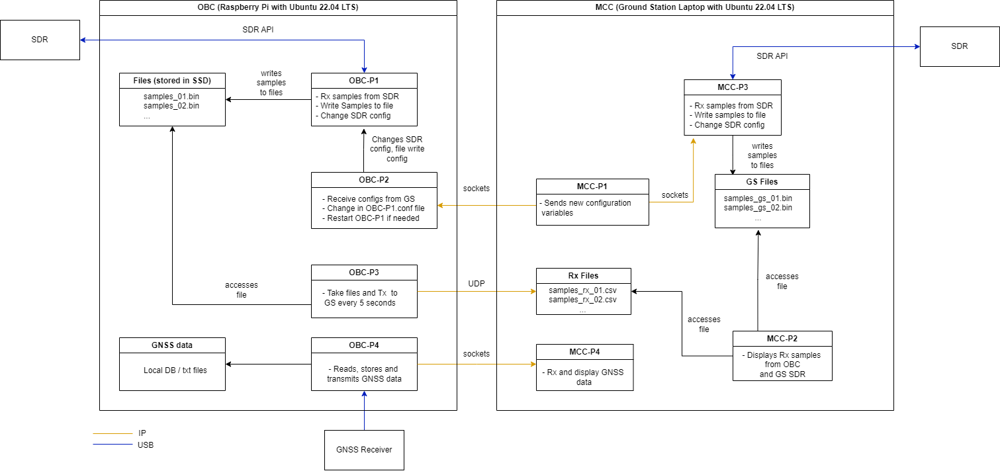

### SMART Experiment Software Architecture

#### OBC - On-Board Computer

- Raspberry Pi 4
- Running Ubuntu 22.04 LTS

OS config:
- [ ] Read-only filesystem except SSD and conf files.

Programs:
---
- [ ] OBC-PC1.c
    - Interfaces with SDR:
        - [ ] Receives samples
        - [ ] Writes to filesystem
        - [ ] Downsamples data
---
- [ ] OBC-PC2.c
    - Interfaces with MCC
        - [ ] Receives commands
            - TODO: define parameters to be changed
        - [ ] Changes necessary config parameters
---
- [ ] OBC-PC3.c
    - Interfaces with OBC-PC1 and MCC
        - [ ] Receives downsampled files (from filesystem or directly from OBC-PC1)
        - [ ] Transmits data to MCC
---
- [ ] OBC-PC4.c
    - Interfaces with GNSS Receiver
        - [ ] Receives data from Receiver 
        - [ ] Stores data locally
        - [ ] Transmits data to MCC
---

#### MCC - Mission Control Computer

- Laptop 
- Running Ubuntu 22.04 LTS

Programs:
- [ ] MCC-PC1
- [ ] MCC-PC2
- [ ] MCC-PC3
- [ ] MCC-PC4

MCC programs will be implemented in matlab as a standalone app. 
