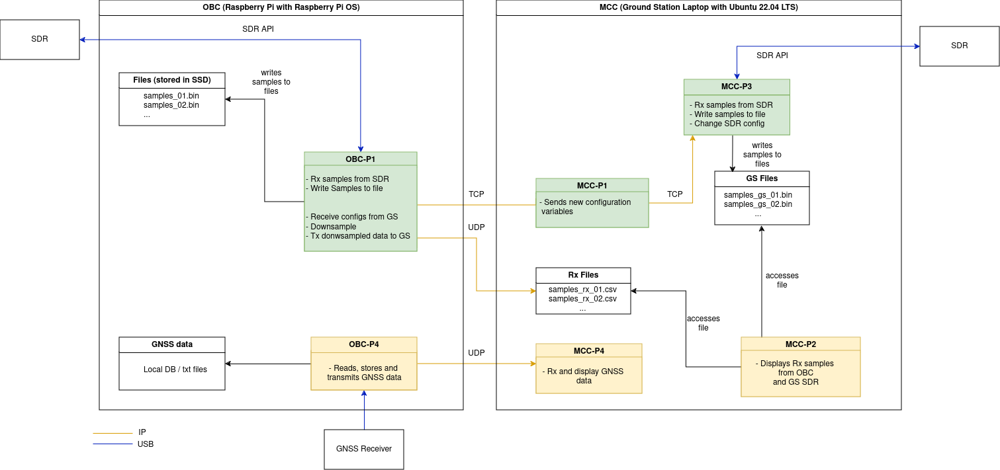

# SMART Experiment Software Architecture

#### OBC - On-Board Computer

- Raspberry Pi 4
- OS: Raspbian (Debian)

OS config:
- [ ] Read-only filesystem except SSD and conf files (last section of [this document](docs/ro_rootfs.pdf))

Programs:

---
- [ ] OBC-P1.c
    - [x] Receives samples from SDR
    - [x] Change SDR configuration
    - [x] Writes to filesystem
        - [ ] TODO: Change write to always instead of when connected_to_GS (keep for testing)
    - [x] Receive commands
    - [x] Parse Comands
    - [ ] Center signal to desired frequency before downsample
    - [x] Downsample data (factor of 2048: 8M -> 3.9062k)
    - [ ] Transmit  downsampled data to MCC   

##### Command format:

    :[command]:[value]:

    e.g.

    Change central frequency to 140MHz
    :F:140000000:

    Send heartbeat (no value needed)
    :H:

Available commands:

| command | name | value |
|-|-|-|
| H | Heartbeat | no value |
| F | Tuner central frequency| in Hz |
| S | Sampling Frequency | in Hz |

---
- [ ] OBC-P4.c
    - Interfaces with GNSS Receiver
        - [ ] Receives data from Receiver 
        - [ ] Stores data locally
        - [ ] Transmits data to MCC
---

#### MCC - Mission Control Computer

- Laptop 
- Running Ubuntu 22.04 LTS

Programs:
- [ ] MCC-P1
    - Sends commands periodically, create new connection every time.
- [ ] MCC-P2
- [ ] MCC-P3
- [ ] MCC-P4

MCC programs will be implemented in matlab as a standalone app. 

| Unit | Port |Program|    Use         | 
|------|------|-------|----------------|
|OBC   | 9090 | OBC-P1|Receive commands to change SDR tuner configuration|
|OBC   |22    |  ssh  |  Open ssh connection     |
|MCC   | 9191 | MCC-P1|Receive I/Q data from SS  |